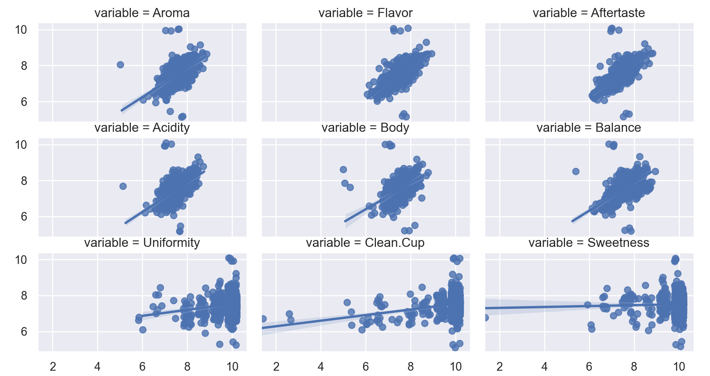
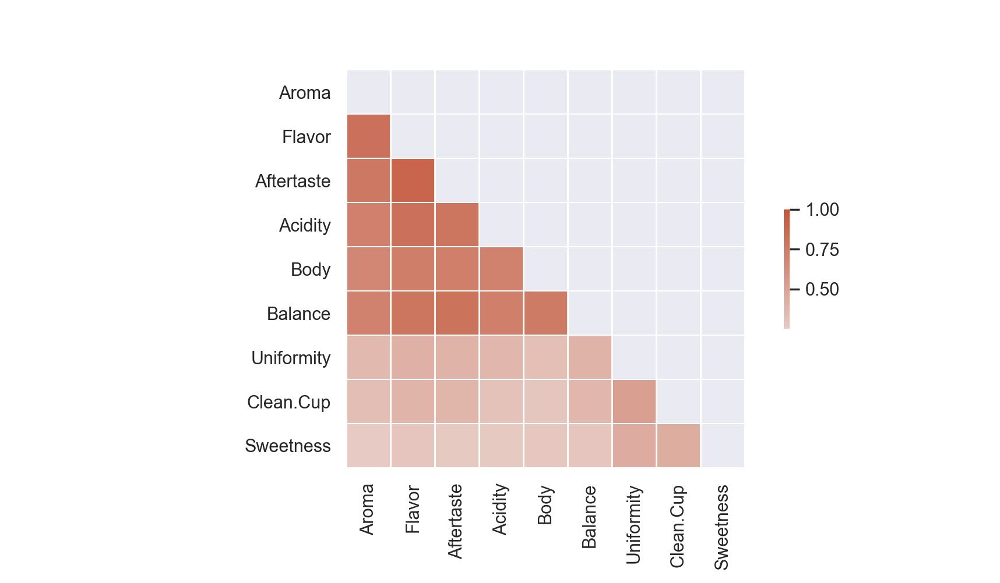
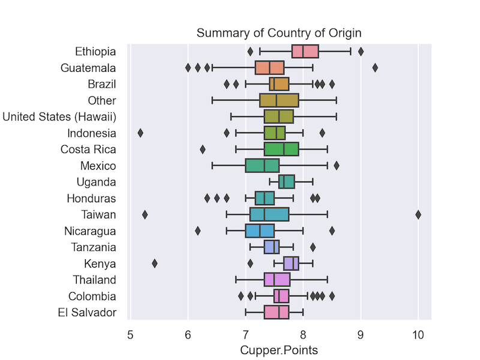
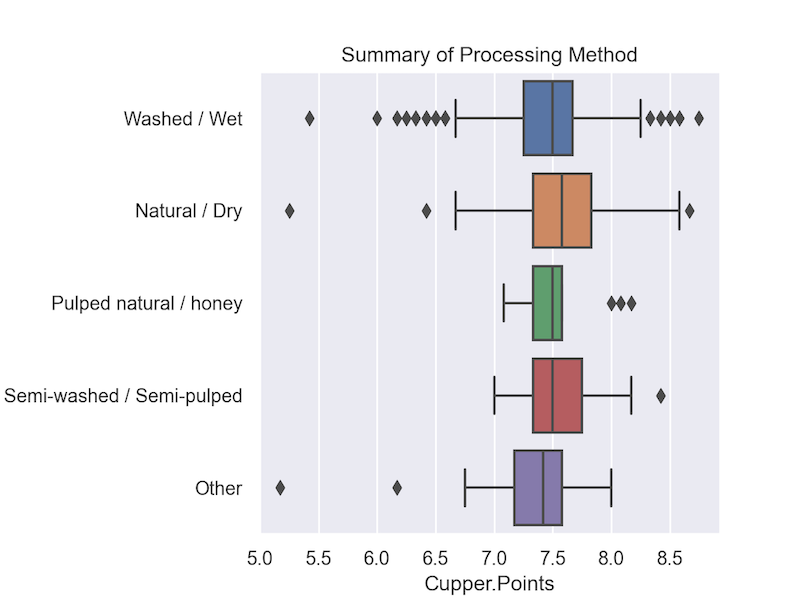
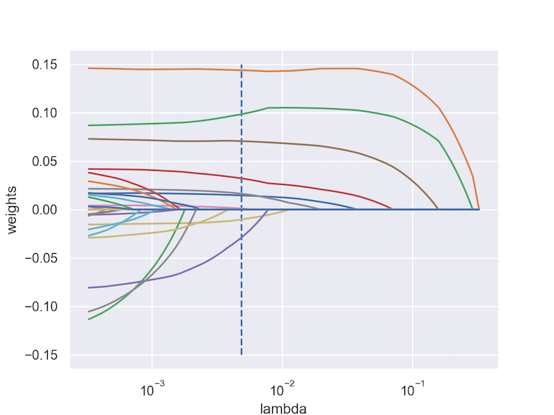

### Feature Selection

Choosing a coffee is fundamentally an exercise in prediction. Presumptive coffee drinkers are presented with an onslaught of variables describing a coffee's origins, flavors, sent, texture and roasting processes. The combination of variables can rapidly increases to the point of becoming overwhelming. While to much information is overwhelming, when coffee drinkers do not have enough information they may choose a coffee that ends up being a disappointment. Put simply predicting whether a coffee will be good or bad is balance between considering to much information and not enough. 

Machine learning algorithms face a similar challenge: the bias variance trade off. Models that are fit with too many irrelevant features (another term for variables) have higher variance, become overfit and cannot generalize to new data. However, models fit with to few variables have higher bias, are underfit and have poor predictive ability. The least absolute shrinkage and selection operator (lasso) addresses this trade off by shrinking the coefficients of some features to zero, effectively removing them from the model. The Lagrangian formula for the lasso is shown below. The amount of shrinkage applied to features is determined by the size of the tunable hyper-parameter $\lambda$. When $\lambda$ is set to 0, the lasso becomes the familiar ordinary least squares regression model(OLS regression). As $\lambda \to \infty$ the amount of shrinkage increases dropping more features from the model. 

\begin{equation*}
\hat{\beta}^{\text{lasso}} = \space \begin{matrix} \\ \text{argmin} \\ \beta \end {matrix}
\bigg\{\frac{1}{2} \sum_{i = 1}^{N} (y_{i} - \beta_{0} - \sum_{j = 1}^{p}x_{ij} \beta_{j})^{2} + \lambda \sum_{j=1}^{p} |\beta_{j}|  \bigg\}
\end{equation*}

The following analysis applies the feature selection properties of the lasso to the the [coffee quality data set](https://www.kaggle.com/volpatto/coffee-quality-database-from-cqi). The data  provides a score of cupper points measuring a coffees overall experience for 1312 unique coffees. Some variables in the data set, such as a the elevation a coffee is grown at, are often not advertised to prospective coffee drinkers. After removing these variables, there are 31 unique features that can be used predict cupper points. Of the 31 variables, 9 are continuous measures of coffee characteristics scored on a 10 point continuous scale: Aroma, Flavor, Aftertaste, Acidity, Body, Balance, Uniformity, Clean Cup and Sweetness. All remaining variables are categorical indicating a coffees country of origin and the processing method used. 

### Descriptive Plots 

Before fitting lasso, exploratory data visualizations help to understand the feature space and how features are related to one another. 

The plot below presents a scatter plot comparing cupper points with each continuous predictor variable. A simple univariate regression of cupper points on the predictor is plotted over the scatter plot. As shown, there is evidence of several linear relationships between predictors and outcomes. While this plot provides a summary of each predictors unique relationship with cupper points it does not account for covariance between predictors.

The correlation plot below can build understanding of the strength of relationships between predictors. Comparing correlations reveals that Aroma, Flavor, Aftertaste, Acidity and Body are strongly linearly related while Uniformity, Clean Cup and Sweetness have a weaker, but still positive, correlation with other predictors. 

Boxplots shown below, provide a visualization of the descriptive relationships between all categorical variables and cupper points. Country of origin and processing methods are presented in two separate plots.

### Fitting the lasso

The descriptive summaries affirm the challenge of using even moderately large feature sets. By fitting the lasso, many of these features can be removed while subsequently increasing predcitive power. Fitting a lasso model requiors selecting an optimal value for $\lambda$. To determine this value, [Five fold cross validation](https://scikit-learn.org/stable/modules/cross_validation.html) was used to determine the optimal value of $\lambda$ from 10,000 possible values. The process of fitting the lasso is summarized in the  trace plot below. Each solid line represents one of the 31 features. The y axis represents the weight or coefficient value while the X axis represents different values of $\lambda$, the dashed blue line represents the optimal $\lambda$ value that was determined from cross validation. As the value of $\lambda$ increases, the penalty becomes greater which shrinks coefficients closer to 0. All features that do not touch 0 at the optimized $\lambda$ value remain in the model while all features that touch 0 to the left of the optimized $\lambda$ value are effectively removed from the model. 

The lasso removed 22 of the original 31 variables leaving 9 variables used for prediction. The features selected are shown in the table below. Using the final model to predict the cupper points of a held out unseen test set resulted in a [root  mean square error (RMSE)](https://statweb.stanford.edu/~susan/courses/s60/split/node60.html) of .1005. Put anohter way, when used to predict the cupper points of a new coffee, predictions from the final model are expected to only be .1 points different than the true cupper point score. Given that scores range on a continuous sclae from 6 through 10, this is  a highly accurate prediction.

| Feature      |      Weight |
|:-------------|------------:|
| Aroma        |  0.0146423  |
| Flavor       |  0.143905   |
| Aftertaste   |  0.0985034  |
| Acidity      |  0.032222   |
| Balance      |  0.0706847  |
| Uniformity   |  0.00105952 |
| Clean Cup    |  0.0163488  |
| Sweetness    | -0.0101831  |
| Guatemala    | -0.0287209  |

According to the final model, coffees with higher scores on Aroma, Flavor, Aftertaste, Acidity, Balance, Uniformity and having a Clean Cup increase the predicted cupper point score, while coffees with higher sweetness scores and from Guatemala decrease predicted cupper point scores. These results challenge the efficacy of basing coffee decision making on of a coffees country of origin or processing method when more detailed information about the coffees profile is available. Of the 17 unique countries, the lasso removed all but one. In the case of processing method, all variables were dropped from the model. Put simply, good and bad coffees come from all coffee producing countries and all processing methods, what sets a coffee apart can not be generalized from such broad categories.

### Limtations

The shrinkage properties of the lasso substantially reduce variance while allowing slight increases in bias. As a consequence of this trade off, feature weights can no longer be interpreted in the same way as a standard OLS regression. Due to the estimation processes, it is known that the coefficients have become biased. While this bias does not harm model predictions, it interferes with the ability to make inferences based upon output. In the context of this analysis, it is inappropriate to look at the feature weight of Flavor and conclude that an increase of one unit in Flavor is associated with an increase in the expectation of cupper points by .143905. The lasso offers a broad picture of which variables are most relevant to prediction but can not offer unbiased and precise estimates of those variables. 

### Conclussion

The lasso is a powerful technique that can simplify the feature space while reserving predictive power. In the case of coffee, accurate predictions about of coffees overall experience can be made using only 9 of the 31 available features. In commercial settings, a coffee's processing method and country of origin may be promoted, however, the model found that these features are not needed when adequate data about the flavor profile is provided. To view the Python code used to fit the lasso model, I invite you to visit it the [Coffee-ML repository](https://github.com/gperrett/Coffee-ML) at my GitHub. 

